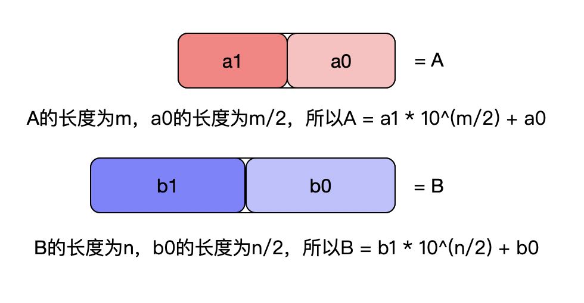

# [Multiply Strings](https://leetcode.com/problems/multiply-strings/)

Given two non-negative integers `num1` and `num2` represented as strings, return the product of `num1` and `num2`, also represented as a string.

Example 1:

    Input: num1 = "2", num2 = "3"
    Output: "6"

Example 2:

    Input: num1 = "123", num2 = "456"
    Output: "56088"

Note:

1. The length of both `num1` and `num2` is < 110.
2. Both `num1` and `num2` contain only digits `0-9`.
3. Both `num1` and `num2` do not contain any leading zero, except the number 0 itself.
4. You **must not use any built-in BigInteger library** or **convert the inputs to integer** directly.

# 思路

> 大数乘法是典型的分治问题。

结果为：`A*B = a1*b1 * 10^(m/2 + n/2) + a1*b0 * 10^(m/2) + a0*b1 * 10^(n/2) + a0*b0`。

由上可以知：
1. 得先解决大数相加的问题。
2. `10^(m/2)` 表示在数字字符串后追加`m/2`个`0`。
